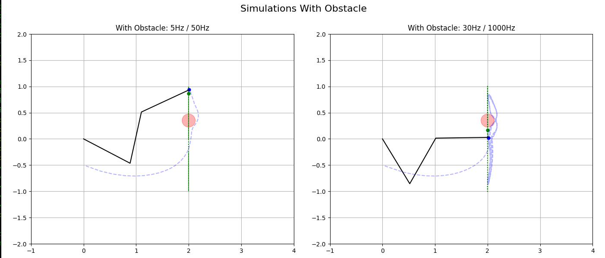

# Robot End-Effector Control

This project simulates a 3-DOF planar RRR (Revolute-Revolute-Revolute) robot arm tracking a moving target in 2D space. It includes inverse kinematics, PID control and optional obstacle avoidance using repulsion force field. Animations are created using `matplotlib`.

---

## Directory Structure

```
Robot_EndEffector_Control/
├── docker-compose.yml                                      # Docker Compose for running simulation
├── Intern Challenge_ RRR Robot End-Effector Control.pdf    # Internship - Question
├── Dockerfile                                              # Python-based simulation image
├── requirements.txt                                        # Python dependencies
├── README.md                                               # Project documentation
└── src/
    ├── Robot.py                                            # Main script
    └── sim.py                                              # Simulator Class
```

---

## Dependencies and System Requirements

Python Requirements:
- numpy 
- scipy 
- matplotlib
- pandas 
- openpyxl 

All the requirements are installed inside the docker container. Hence no local installation is required for this to run. 

Tested On:
- OS : Ubuntu 24.04
- IDE: VS Code
- GPU: RTX 5090
- CPU: AMD 9950X3D
- RAM: 96GB RAM

---

## Implementations

- 2D Cartesian tracking of a moving sinusoidal target
- Inverse kinematics solver for RRR manipulator
- PID-based joint control with integral and derivative terms
- Obstacle repulsion modeled using a virtual force field
- Real-time animation of robot arm and end-effector path

---

## Setup and Run the Code

### Prerequisites

- Ensure docker and docker-compose is installed locally.

### Run with obstacle:

```bash
docker compose --profile sim-obstacle up --build
```
### Run without obstacle:

```bash
docker compose --profile sim up --build
```

Each code launches a side-by-side animation of the robot behavior at:
- 5 Hz target / 50 Hz control rate
- 30 Hz target / 1000 Hz control rate

---

## Description of Our Approach

Assumptions:
- L1 = L2 = L3 = L = 1 (Considering the leghts of all links as same and equal)
- Obstacle Centre = [2.0, 0.35]
- Obstacle Radius = L/8

This project simulates the Cartesian trajectory tracking of a 3-DOF planar RRR robotic manipulator. The robot is designed to follow a time-varying target in a 2D space using inverse kinematics and a basic PID joint controller. Key components of the simulation include:

- **Trajectory Generation**: A sinusoidal path is generated for the end-effector using defined target frequency and duration.
- **Inverse Kinematics (IK)**: The system computes all valid joint configurations for a given target using closed-form solutions for the planar RRR arm.
- **PID Controller**: Joint angles are regulated using a proportional–integral–derivative control loop that attempts to minimize error over time.
- **Obstacle Avoidance**: An optional circular obstacle introduces repulsive forces near its boundary, modifying the target dynamically to avoid collisions.
- **Visualization**: Real-time simulation is rendered using `matplotlib.animation`, showing the robot arm, target path, and end-effector trajectory.

Two simulation configurations are used here and the ouputs are given below in the Simulation Outputs section.
- **Without obstacle**: Simple target tracking using IK and PID.
- **With obstacle**: Dynamically adjusts motion based on virtual repulsion from the obstacle.

- **NOTE**: 
- In the given Task, Target motion was given as (x, y) = (2L, L · sin(2πft)). Which means that X is constant and will travel in a straight line as seen from X-Axis. Y varies based on the X. But this does not look sinusoidal 
as seen from XY Plane. This is assumed that the platform must be moving and hence the sinusoidal wave.  
- The position for Obstacle was given as (x, y) = (L, 0.5L). This position according to out configuration is off the graph. The robot which follows  (x, y) = (2L, L · sin(2πft)) patgh never touches or interferes with the obstacle.
Hence a different Obstacle position was chosen to demonstarte the obstacle avoidance algorithm. The position assumed was (2.0, 0.35) for better Visualization. 


---

## Simulation Ouput

Below are outputs from the Simulations.

### 🔹 Without Obstacle vs With Obstacle

<p align="center">
  
  
</p>

From the Figure, We can confirm the working of Obstacle avoidance. If an obstacle is detected, the imaginary force field will repel the End-Effector and thus avoiding the collision with the obstacle. 

---